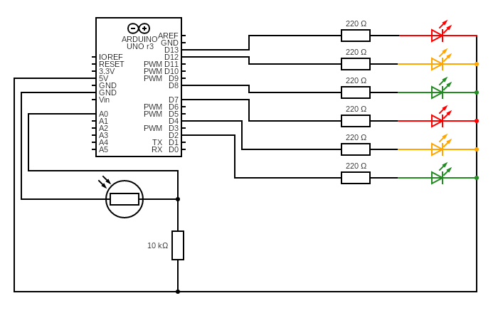
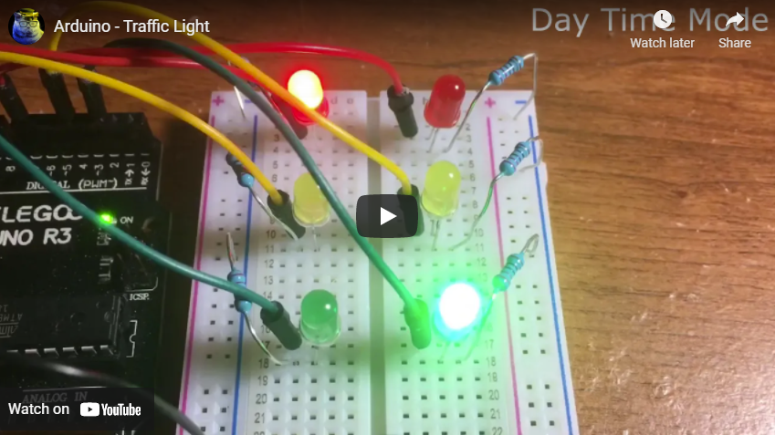

# Traffic_Light
 Traffic light simulation with light sensor created using Arduino (C / C++)

 

 
- The program circuit has a North/South and a West/East side which corresponds to a intersection.
- Each side will alternate between Red / Green, Red / Yellow, and Green / Red.
- There is a built in LDR that detect the room light and switch between Day Mode and Night Mode.
- Night Mode will be flashing yellow on one side (Yield) and flashing red on the other side (Stop).

<h3>The circuit:</h3>

<h3>Check it out:</h3>

